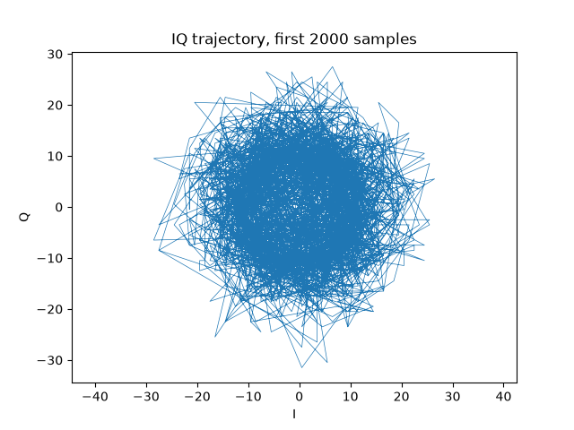
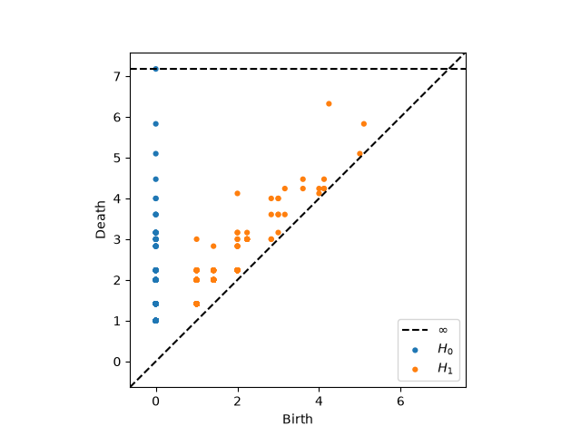
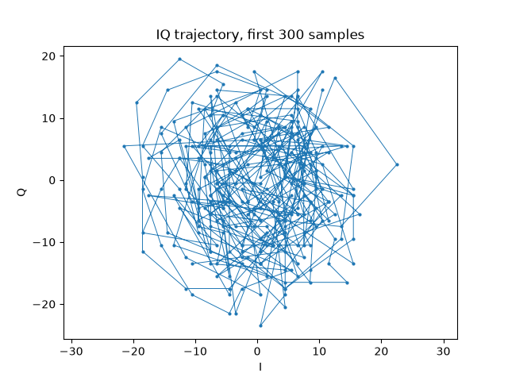
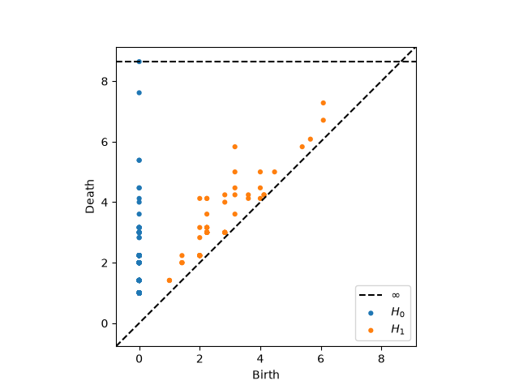

# Topological Analysis of RF Signals: IQ Trajectory Structure and Persistent Homology

## What is persistent homology?

### How does this relate to IQ signal analysis

## Testing a known frequency &mdash; 99.5 MHz

Using 99.5 MHz, 250 kS/s, we captured a local FM radio station, with two window sizes (2000 and 300 contiguous samples). We used a NESDR SMArt v5 dongle with a R820T2 tuner IC.

**Claim:** FM is a circle. When plotting IQ samples, we should expect the IQ plane to be a circle for FM.

Because FM is constant-envelope modulation[^1][^2], the signal's amplitude should be constant, and the IQ point should orbit the origin at a constant radius.

**Observation:** Under both windows, the IQ trajectory plot and persistence diagram do not show a ring. At the shorter window (300 samples), the trajectory is messier and more chaotic. At 250 kS/s with the tuner's frequency offset, the longer (2000-sample) and shorter (300-sample) windows do not produce a clean single-loop IQ trajectory.

**Working hypothesis:** The carrier frequency offset from imperfect tuning is large enough relative to the sample rate such that the rotation does not resolve in a slow, clean loop at either window size (at least with a R820T2 tuner).

### Null results

We cannot conclude that raw IQ traces a clean circle. Our results show that some form of adjustment (e.g., frequency offset correction) is required to produce this conclusion.

### Further questions

- Does our working hypothesis hold? Does adjusting the frequency offset lead us closer to a clean circle, or is the assumption in our claim completely naive?
- Is the "circle" intuition a simplification? Can we ever expect this clean of an outcome?

[^1]: This property is not specifically applied to FM and is a more general principle. [https://descanso.jpl.nasa.gov/monograph/series3/chapter2.pdf](https://descanso.jpl.nasa.gov/monograph/series3/chapter2.pdf)
[^2]: Haykin, Simon and Moher, Michael. Chapter 4: Angle Modulation. _Communication Systems, 5th ed._