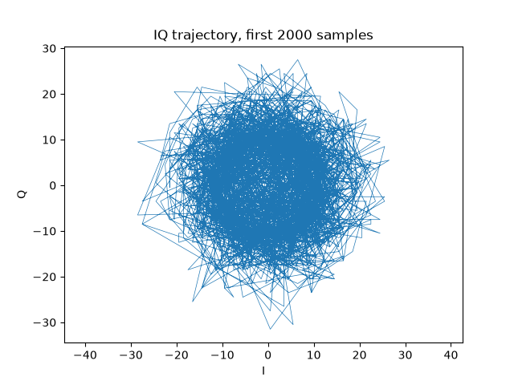
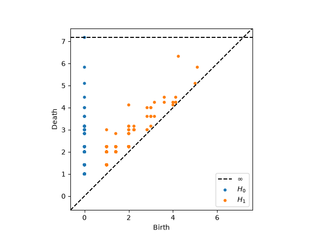
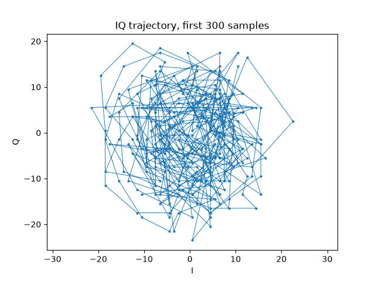
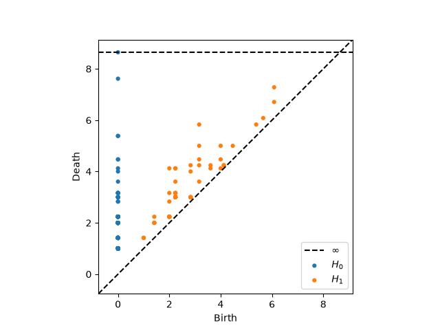
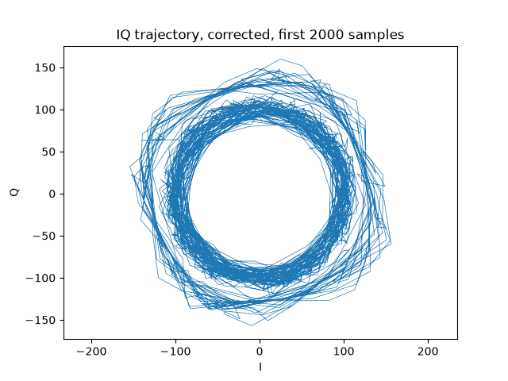
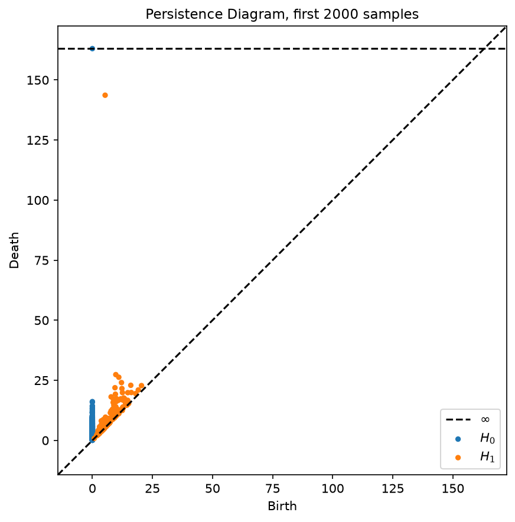

# Topological Analysis of RF Signals: IQ Trajectory Structure and Persistent Homology

## What is persistent homology?

In a general sense, Perea and Harer[^6] describe persistent homology as

> Persistent homology is a topological method for measuring the shapes of spaces
> and the features of functions.

Ghrist[^5] describes it as "a homology theory for point-cloud data sets," and Wright[^4] gives a slightly more terse definition of persistent homology as

> an algebraic method for discerning topological features of data,

such as components, clusters, holes, and graph structure.

Nevertheless, Perea, Harer, and Wright begin their exposition using the concept of a point cloud&mdash;a mechanism with which we sample to hopefully derive the "geometry of some implicit underlying object"[^6]. Perea and Harer[^6] specifically show that a sliding-window, or time-delay embeddings, point cloud of periodic and quasi-periodic time-series data reveal a circular or toroidal structure, and the same time-delay embedding approach is used in `sdr_topology.embedding.delay` in this package. Thus, the point cloud is similarly significant in our analysis, as we will demonstrate with the following illustration.

Consider a point cloud of data, which has holes at some scales. We use persistent homology to track which holes survive across a range of scales. In this document, we hand compute a boundary matrix and analyze its filtration step, which is related to tracking holes that survive across a range of scales, and compare it to data captures from our software package to determine if our hand computation aligns with the computation Ripser method applied in our Python package.

We will attempt to look for holes in our capture data and evaluate $$H_1$$ in a persistence diagram, which is instrumental for analyzing the filtration process. In both the hand-derived and software-computed instances, we build simplicial complexes, and persistent homology allows us to find the "holes" in our complex and discern meaningful features from noise (in this case, holes that do not survive across a range of scales).

### How does this relate to IQ signal analysis

In-phase and quadrature component&mdash;IQ&mdash;signals can be captured to form a point cloud in the complex plane. Because FM is constant-envelope modulation[^1][^2], we expect the trajectory to form a hole at the origin, forming a "donut" (or annulus) rather than a disk. The presence and stability of an $$H_1$$ feature provides a direct topological signature of whether or not the constant-envelope property is (approximately) holding in the real world.

Given this, we have a testable hypothesis: FM should trace a ring/annulus, not a disk. This document directly tests this hypothesis and includes an instance where the naive prediction initially failed to hold.

In addition to testing our hypothesis, we use our hand-derived matrix to verify if our results agree with our software-computed results in cases where the prediction holds.

## Testing a known frequency &mdash; 99.5 MHz

Using 99.5 MHz, 250 kS/s, we captured a local FM radio station, with two window sizes (2000 and 300 contiguous samples). We used a NESDR SMArt v5 dongle with a R820T2 tuner IC.

**Claim:** FM is a circle. When plotting IQ samples, we should expect the IQ plane to be a circle for FM.

Because FM is constant-envelope modulation[^1][^2], the signal's amplitude should be constant, and the IQ point should orbit the origin at a constant radius.

**Observation:** Under both windows, the IQ trajectory plot and persistence diagram do not show a ring. At the shorter window (300 samples), the trajectory is messier and more chaotic. At 250 kS/s with the tuner's frequency offset, the longer (2000-sample) and shorter (300-sample) windows do not produce a clean single-loop IQ trajectory.






**Working hypothesis:** The carrier frequency offset from imperfect tuning is large enough relative to the sample rate such that the rotation does not resolve in a slow, clean loop at either window size (at least with a R820T2 tuner).

### Null results

We cannot conclude that raw IQ traces a clean circle. Our results show that some form of adjustment (e.g., frequency offset correction) is required to produce this conclusion.

#### Verification of correction hypothesis

After adding a phase modulation correction, we were able to find the estimated offset:

```
Estimated offset: -0.001555 rad/sample
Equivalent frequency: -61.87 Hz
```

This small offset nonetheless produced a cleaner annulus (with noise) with a hole in the middle:



This shows the trajectory is sensitive even to very small residual rotation, giving more credence to the working hypothesis. We then explored the $$H_1$$ features on the corrected samples, which showed

```
H1 features: 461
Max persistence: 138.3449
Top 5 lifetimes: [138.34494   17.618214  15.287685  12.506098  11.943707]
Dominant H1 feature (raw): birth=5.3172, death=143.6621
```

And the persistence diagram:



This shows the raw death value as the distant $$H_1$$ point (in orange), and, with a birth of 5.3172, yields a lifetime of 138.3449, which supports the one-dominant-loop claim our output illustrates.

The IQ trajectory gives the shape we expected, but the claim that "FM is a circle" was not possible to accept without tuner frequency offset corrections. The offset here was minimal in absolute terms (nearly 62 Hz frequency, 0.62 ppm), but **even a small offset can drastically change the trajectory shape and $$H_1$$ top lifetimes**.

FM is not _precisely_ a circle but _approximately_ holds under real hardware.

### Verification of pipeline correctness against hand-derived homology

We computed a boundary matrix, $$\partial_{1}$$ and $$\partial_{2}$$ by hand against a subset of the sample data.
We let four points in the cycle (the IQ annulus) spread nearly $$90\circ$$ apart with no diagonal at filtration
$$\epsilon \in \left(180.3, 239.0\right)$$. (While the filtration choice is arbitrary, as shown below, the diagonal uses actual points from our capture.)
We let $$\partial_{1}$$ be a $$4 \times 4$$ matrix initially representing a 4-cycle
with vertices $$v_0$$, $$v_1$$, $$v_2$$, and $$v_3$$. We constructed $$\partial_{1}$$ as follows:

$$\partial_{1}=\begin{bmatrix}-1 & 0 & 0 & 1\\
1 & -1 & 0 & 0\\
0 & 1 & -1 & 0\\
0 & 0 & 1 & -1
\end{bmatrix}$$

with the following orientations:

- $$v_0 \to v_1$$
- $$v_1 \to v_2$$
- $$v_2 \to v_3$$
- $$v_3 \to v_0$$

This matrix has $$\textrm{rank}(\partial_{1})=3$$ and $$\textrm{nullity} = 1$$.

We find a diagonal edge in our data $$v_1 \to v_3$$, so our final $$\partial_{1}$$ was

$$\partial_{1}=\begin{bmatrix}-1 & 0 & 0 & 1 & 0\\
1 & -1 & 0 & 0 & -1\\
0 & 1 & -1 & 0 & 0\\
0 & 0 & 1 & -1 & 1
\end{bmatrix}$$

with $$\textrm{rank}(\partial_{1})=3$$ and $$\textrm{nullity} = 2$$.

This yields a basis for the 2-dimensional kernel, expressed in the edge basis $$\left(e_0, e_1, e_2, e_3, e_4\right)$$: a 4-cycle ("square") and 3-cycle ("triangle").

$$e_0 + e_1 + e_2 + e_3$$
$$e_1 + e_2 - e_4$$

which we suppose is related to $$\partial_{2}$$ columns, where $$e_0 + e_1 + e_2 + e_3 = \textrm{col}_1 + \textrm{col}_2$$.

(Note: $$e_0 - e_1 - e_2 + e_3 + 2e_4$$ was originally found but can be rewritten as $$\left(e_0 + e_1 + e_2 + e_3\right) - 2\left(e_1 + e_2 - e_4\right)$$, thus reducing to the cycles above.)

To compute $$\partial_{2}$$, we considered these 2-simplices around the "triangles"
$$\sigma_{1} = [v_0, v_1, v_3]$$ and $$\sigma_{2} = [v_1, v_2, v_3]$$, making $$\partial_{2}$$ a $$5 \times 2$$ matrix expressed in terms of the edge basis $$\left(e_0, e_1, e_2, e_3, e_4\right)$$ for each respective row

$$
\partial_{2}=\begin{bmatrix}1 & 0\\
0 & 1\\
0 & 1\\
1 & 0\\
1 & -1
\end{bmatrix}
$$

Then, $$\partial_{1}\partial_{2}=0$$, and $$\partial\sigma_{1} + \partial\sigma_{2} = e_0 + e_1 + e_2 + e_3$$, confirming our earlier supposition. In our capture data,

- $$\sigma_1 = [v_0, v_1, v_3]:$$ edges are $$e_0$$ (169.3), $$e_3$$ (180.3), and $$e_4$$ (239.0). The max is $$239.0$$, arriving when $$\epsilon = 239.0$$.
- $$\sigma_2 = [v_1, v_2, v_3]:$$ edges are $$e_1$$ (169.4), $$e_2$$ (180.3), and $$e_4$$ (239.0). The max is $$239.0$$, arriving when $$\epsilon = 239.0$$.

Therefore, $$\sigma_1$$ and $$\sigma_2$$ share a bottleneck edge at $$e_4$$.

Further, both columns are independent and span a 2-dimensional image inside a 2-dimensional kernel, thus $$\textrm{im}\left(\partial_{2}\right) = \ker\left(\partial_{1}\right)$$ and therefore

$$H_{1} = \ker\left(\partial_{1}\right)/\textrm{im}\left(\partial_{2}\right) = 0$$[^3],

and the hand-computed matrix matches the persistence diagram. The loops given above get filled once a single filtration event ($$H_{1}$$ born at $$\epsilon \approx 180.3$$, death at $$\epsilon \approx 239.0$$) arrives, eliminating the 2-dimensional $$\textrm{im}\left(\partial_{2}\right)$$ mapping onto $$\ker\left(\partial_{1}\right)$$ in one step, in agreement with the Ripser output.

### Further questions

- ~~Does our working hypothesis hold? Does adjusting the frequency offset lead us closer to a clean circle, or is the assumption in our claim completely naive?~~
- ~~Is the "circle" intuition a simplification? Can we ever expect this clean of an outcome?~~

## Miscellany

Wright's video surveys several authors, including Ghrist and Perea-Harer, cited in this document. It should be noted that Wright's definition follows Perea and Harer's framing, and he cites Ghrist's survey&mdash;a synthesis of Perea-Harer, Carlsson, Edelsbrunner, Zomorodian, et al. Wright's academic lineage [traces through Ghrist as his PhD advisor](https://www.mlwright.org/docs/cv_web.pdf), which may explain the closeness of the framing, though the content is independently traceable to the primary sources below.


[^1]: This property is not specifically applied to FM and is a more general principle. [https://descanso.jpl.nasa.gov/monograph/series3/chapter2.pdf](https://descanso.jpl.nasa.gov/monograph/series3/chapter2.pdf)
[^2]: Haykin, Simon and Moher, Michael. Chapter 4: Angle Modulation. _Communication Systems, 5th ed._
[^3]: Ghrist, Robert J. Chapter 4: Homology. _Elementary Applied Topology._ [https://www2.math.upenn.edu/~ghrist/EAT/EATchapter4.pdf](https://www2.math.upenn.edu/~ghrist/EAT/EATchapter4.pdf)
[^4]: Wright, Matthew. "Introduction to Persistent Homology." [https://www.youtube.com/watch?v=2PSqWBIrn90](https://www.youtube.com/watch?v=2PSqWBIrn90)
[^5]: Ghrist, Robert. "Barcodes: The persistent topology of data" Bulletin of the American Mathematical Society 45 (2008): 61-75. https://pubs.ams.org/journals/bull/2008-45-01/S0273-0979-07-01191-3
[^6]: Perea, Jose A., and John Harer. "Sliding Windows and Persistence: An Application of Topological Methods to Signal Analysis." Foundations of Computational Mathematics 15.3 (2015): 799-838. https://arxiv.org/abs/1307.6188